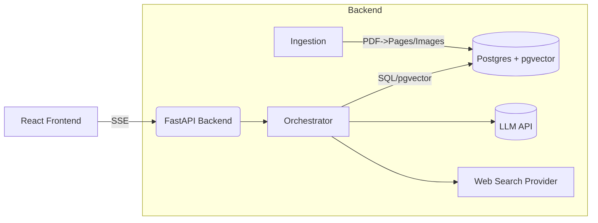

## THIS IS A WORK IN PROGRESS PROJECT

# RAG PDF/Web QA

End-to-end Retrieval-Augmented Generation system for answering questions based on uploaded PDFs and (optionally) web results. It includes:

- FastAPI backend with PostgreSQL + pgvector for vector search
- React + TypeScript frontend (Vite) with SSE streaming
- Robust ingestion (text + images) via PyMuPDF
- Orchestrated retrieval with multi-round batching and LLM-guided decisions

This README explains architecture, setup, configuration, and usage.

---

## Authors and Purpose

This project is a collaboration for studying modern development and Artificial Intelligence technologies, developed by:

- **Larissa Rodrigues** (AI Engineer) - [LinkedIn](https://www.linkedin.com/in/lari-rodriggs/)
- **Vinicius de Moura** (Fullstack Software Engineer) - [LinkedIn](https://www.linkedin.com/in/deviniciusg/)
- **Sofia Rigonati** (Fullstack Software Engineer) - [LinkedIn](https://www.linkedin.com/in/sofia-rigonati-magalh%C3%A3es-louzada-7405b7250/)

---

## Contents

- [Architecture](#architecture)
- [Repository structure](#repository-structure)
- [Prerequisites](#prerequisites)
- [Environment variables](#environment-variables)
- [Running (Docker Compose)](#running-docker-compose)
- [Running (local dev)](#running-local-dev)
- [Testing and Evaluation](#testing-and-evaluation)
- [Database and migrations](#database-and-migrations)
- [Backend API](#backend-api)
- [Frontend UX](#frontend-ux)
- [RAG pipeline details](#rag-pipeline-details)
- [Logging](#logging)
- [Troubleshooting](#troubleshooting)
- [Notes and licensing](#notes-and-licensing)

---

## Architecture



- Documents are uploaded as PDFs; text is extracted per page and stored in `documents` / `document_pages`. Images are extracted and saved under `/media`.
- Embeddings (3072-d) are created for non-empty pages and stored in pgvector for ANN search.
- Queries are routed to docs and/or web search. Retrieval happens with ANN; fallback to basic fetch when embeddings are missing.
- The orchestrator tests batches of 3 pages (up to 15) and asks the LLM for a structured decision JSON to continue/accept/fallback to web.
- Answers are streamed to the UI via Server-Sent Events (SSE), followed by a final JSON envelope with citations.

---

## Repository structure

- `backend/`
  - `app/main.py`: FastAPI app and middleware
  - `app/routes/`: API routes (e.g., `chat.py`, `documents.py`)
  - `app/services/`: Core RAG pipeline logic.
  - `tests/`: Unit tests for the backend.
  - `evaluation/`: RAG quality evaluation scripts.
- `frontend/`
  - `src/`: React app (Vite + TypeScript)
- `docker-compose.yml`: services (db, backend, frontend)
- `.env.example`: sample configuration

---

## Prerequisites

- Docker and Docker Compose (recommended), or
- Python 3.11+, Node 20+ (for local dev without Docker)

---

## Environment variables

Copy `.env.example` to `.env` and set values:

- `DATABASE_URL` (e.g., `postgresql+asyncpg://user:pass@db:5432/app`)
- `OPENAI_API_KEY` (or compatible provider key used by `app/services/llm.py`)
- `WEB_SEARCH_PROVIDER` and `WEB_SEARCH_API_KEY` (optional; to enable web search)
- `MEDIA_ROOT` (dev media dir, default mounted at `/media`)
- `LOG_LEVEL` (e.g., `INFO`)

---

## Running (Docker Compose)

1. Create `.env` (see above).
2. Start everything:
   - `docker compose up -d --build`
3. URLs:
   - Backend: http://localhost:8080
   - Frontend: http://localhost:5173
4. Apply DB migrations (if not already applied):
   - `make migrate` (or run Alembic inside the backend container)

---

## Running (local dev)

Backend:

```bash
# Create and activate virtual environment
python -m venv .venv
# Windows (PowerShell): .\.venv\Scripts\Activate.ps1
# Linux/macOS: source .venv/bin/activate

# Install dependencies
pip install -r backend/requirements.txt

# Apply DB migrations (from project root)
alembic -c backend/alembic.ini upgrade head

# Run server
uvicorn app.main:app --reload --port 8080 --app-dir backend
```

Frontend:

```bash
cd frontend
npm install
npm run dev  # http://localhost:5173
```

---

## Testing and Evaluation

This project includes unit tests for backend logic and a RAG quality evaluation suite using [DeepEval](https://github.com/confident-ai/deepeval).

### Unit Tests (pytest)

Unit tests verify specific functions in isolation. After installing dependencies, you can run them from the project root:

```bash
pytest backend/
```

### RAG Evaluation (DeepEval)

DeepEval is used to measure the quality of the RAG pipeline against a golden dataset, using metrics like `AnswerRelevancy` and `Faithfulness`.

**Setup:**

1.  **Ensure Dependencies are Installed:** Make sure you have run `pip install -r backend/requirements.txt` in your active virtual environment.

2.  **Set OpenAI API Key:** DeepEval uses an LLM to score the results. You must set your API key as an environment variable.
    ```powershell
    # In PowerShell
    $env:OPENAI_API_KEY="your-key-here"
    ```

3.  **Upload Test Document:** The evaluation is based on the `samples/plano_negocios.pdf` file. Start the application servers (backend and frontend) and use the web interface at `http://localhost:5173` to upload this PDF.

4.  **Get Document ID:** After uploading, check the logs from your backend server. You will see a line confirming the document was inserted. Copy the `document_id` UUID from this log.
    ```
    INFO: doc_inserted document_id=d5e8b5e9-92b5-45f1-9459-80309451a328 page_count=6
    ```

5.  **Set Evaluation Document ID:** Set the copied ID as an environment variable so the evaluation script knows which document to test against.
    ```powershell
    # In PowerShell
    $env:EVAL_DOCUMENT_ID="d5e8b5e9-92b5-45f1-9459-80309451a328"
    ```

**Running the Evaluation:**

With the backend server running and the environment variables set, run the DeepEval command from the project root:

```bash
deepeval test run backend/evaluation/test_evaluate_rag.py
```

DeepEval will execute the test cases defined in the script and print a detailed report with scores for each metric.

---

## Database and migrations

- Engine: Postgres 15+ with `pgvector` extension.
- Run Alembic migrations from `backend/`:

```bash
alembic upgrade head
```

Key tables:

- `documents(id, title, page_count, ...)`
- `document_pages(id, document_id, page_number, content, embedding vector(3072))`
- `document_page_images(document_page_id, file_url, dimensions)`

---

## Backend API

- `GET /api/healthz`: health probe
- `POST /api/documents`: upload PDFs (multipart); stores text per page and images; generates embeddings
- `GET /api/documents`: list uploaded docs
- `POST /api/chat`: SSE stream
  - Body: `{ messages: [{role,content}...], document_ids?: string[], force_web?: boolean }`
  - Stream:
    - Tokens via `data: <token>\n\n`
    - Final envelope JSON via `data: { ... }\n\n` then `event: end\n\n`

---

## Frontend UX

- Upload PDFs and view document list (title + page count)
- Choose mode: Docs, Web, or Auto
- Ask a question; answer streams token-by-token
- Sources panel shows citations (doc pages and web links)

---

## RAG pipeline details

- `app/services/ingestion.py`:
  - Extracts text per page, saves images to `/media`, writes rows to DB.
  - Generates embeddings (pads/truncates to dim=3072) and persists to `document_pages.embedding`.

- `app/services/ranking.py`:
  - `ann_search_pages()` builds a pgvector query and returns page candidates with `title`, `content`, and a derived `similarity`.

- `app/services/orchestrator.py`:
  - `route_decision(query, doc_ids, force_web)` chooses docs/web.
  - Retrieval: ANN when 3072-d embeddings available, otherwise basic fetch.
  - Dedup + sort by `similarity` desc, `page_number` asc.
  - Multi-round batching: batches of 3 pages, up to 15 pages.
  - For each batch, asks the LLM to return a strict JSON control object via `synthesize_answer_structured()`.

---

## Logging

- Structured logs via `structlog` (JSON-ish). Notable events:
  - `ingest_start`, `doc_inserted`, `page_inserted`, embedding logs
  - `ann_search_params`, `ann_search_pages`
  - `batch_try`, `batch_structured_decision`, `retrieval_sources`
  - `synth_answer`, `synth_structured_answer_raw`, `synth_prompts`

Set `LOG_LEVEL` (e.g., `INFO`, `DEBUG`).

---

## Troubleshooting

- **Embeddings dimension mismatch**
  - We accept any vector size at inference but pad/truncate to 3072 on persistence; ANN path requires 3072-d.

- **No answers from docs**
  - Batching tries up to 15 pages. If none accepted, ensure documents have text extracted and embeddings generated.

- **Media not found**
  - In dev, media is served from `MEDIA_ROOT` mounted at `/media` by `StaticFiles` in `app/main.py`.

---

## Notes and licensing

- PyMuPDF (fitz) has AGPL/commercial licensing. Ensure compliance for your use case.
- Web search is pluggable. Implement `app/services/web_search.py:get_provider()` and configure `WEB_SEARCH_PROVIDER` and `WEB_SEARCH_API_KEY`.
- This codebase is an MVP foundation; audit, security hardening, and evaluations are recommended before production use.

